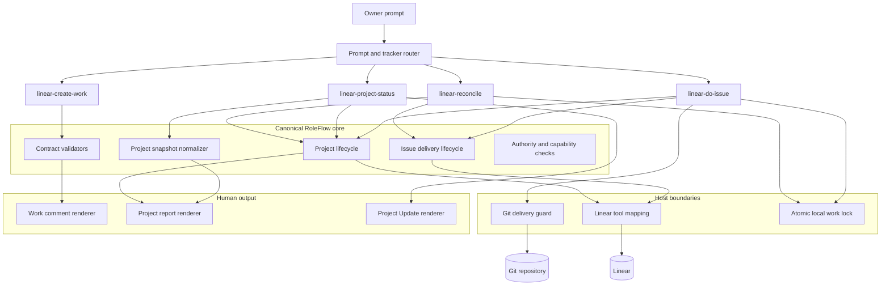
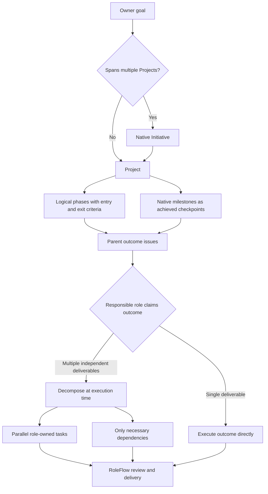
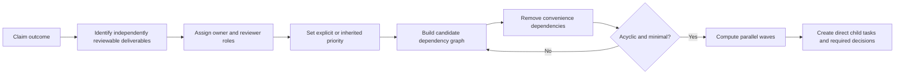
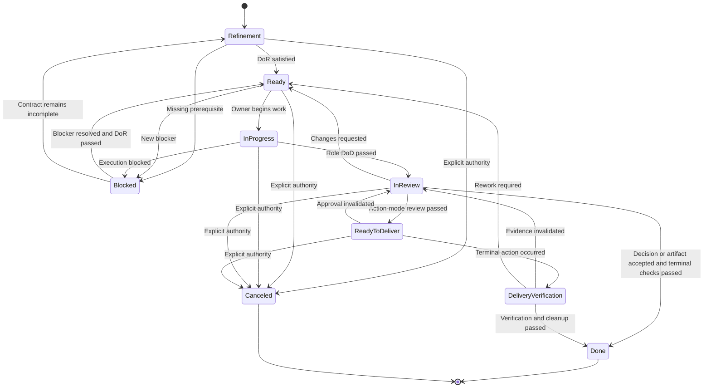
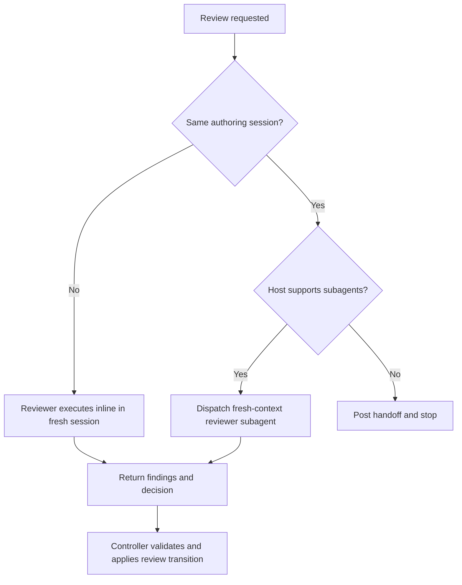
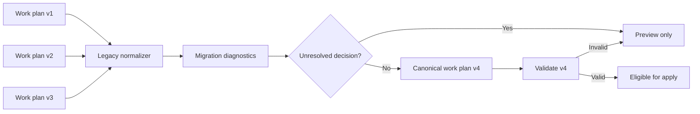
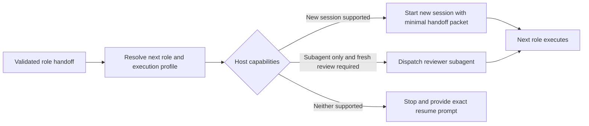
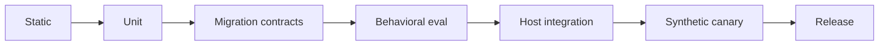

# RoleFlow Contract v4 Design

**Status:** Approved

**Decision:** Adopt Option B with inline execution: a contract-first, multi-department evolution that keeps the four public skills, plans goal structure before task decomposition, reads legacy artifacts, writes canonical work-plan v4 and handoff v2 artifacts, and strengthens lifecycle, review independence, migration, test, packaging, and rollback guarantees.

## Goals

- Make issue delivery and Project lifecycle decisions deterministic and machine-validated.
- Preserve read compatibility for work plans v1-v3 and handoffs v1.
- Prevent premature `Done`, mixed terminal delivery boundaries, unsafe lock recovery, and silent report omissions.
- Keep Linear comments human-readable while retaining local execution detail outside Linear.
- Expose exactly four public skills across supported hosts.
- Support product, engineering, content, marketing, sales, operations, legal, finance, support, and project-defined roles without making software delivery the default workflow.
- Plan phases, milestones, and parent outcomes before creating role-level tasks.
- Decompose an outcome only when its responsible role starts execution, favoring parallel work and avoiding convenience dependencies.
- Require an explicit non-`none` priority for every newly created issue.
- Require fresh-context review when authoring and review would otherwise occur in one session.

## Non-goals

- Build a Linear transport, daemon, scheduler, or distributed lock service.
- Rewrite the four-skill architecture into a workflow engine.
- Delete or recreate existing Linear issues during contract migration.
- Automatically infer ambiguous external actions, production mutations, or delivery authority.
- Change Project scope, priority, assignee, cycle, milestone, or dates during migration.
- Pre-create a complete task backlog from an initial goal before responsible roles claim outcomes.
- Require Git, pull requests, CI, or worktrees for non-software roles.

## Approved Decisions

| ID | Decision |
|---|---|
| D1 | Work plans write v4; handoffs write v2; other artifact versions remain unchanged. |
| D2 | Handoff v2 adds explicit `delivery` and `verification` event types. |
| D3 | Structured `{ mode, check }` terminal verification replaces natural-language mode detection. |
| D4 | Tasks require an outcome parent; decisions may be Project-level or outcome-level. |
| D5 | Ambiguous action modes require a human decision and remain preview-only. |
| D6 | The plugin reads old formats and writes new formats without dual-write. |
| D7 | Migration does not automatically create or delete Linear issues. |
| D8 | Rollback restores reversible fields only after a compare-and-swap safety check. |
| D9 | Local locks use atomic mutation guards plus same-host process liveness checks. |
| D10 | A synthetic Linear Project canary is required before release. |
| D11 | Packaging exposes only `linear-create-work`, `linear-do-issue`, `linear-project-status`, and `linear-reconcile`. |
| D12 | Safety test gates require 100% pass and cannot be waived. |
| D13 | Inline execution is the default implementation mode; review in the same session requires a fresh-context reviewer subagent. |
| D14 | Initial goal planning creates strategy, phases, milestones, outcomes, and decisions but no execution tasks. |
| D15 | Outcome decomposition occurs when the responsible role claims execution and minimizes the dependency graph. |
| D16 | Every new issue has `urgent`, `high`, `normal`, or `low` priority; unspecified priority defaults explicitly to `normal`. |
| D17 | A lifecycle handoff may start a new session with an abstract model/effort profile when the host supports it. |
| D18 | When a host cannot provide fresh-context review or session dispatch, the current run stops at handoff instead of self-approving or pretending dispatch occurred. |

## Target Architecture



The skills remain orchestration entry points. Shared modules own normalization, transitions, validation, tool-value mapping, and rendering behavior.

## Department-neutral Planning Model

RoleFlow models business delivery rather than software development. Software-specific Git and PR controls activate only when the current role is `software-engineer` or the issue delivery contract explicitly requires software evidence.



The initial `goal-structure` plan may create a native Initiative, Project, logical phases, native milestones, outcome parents, and blocking decisions. It must not create execution tasks. Logical phases are RoleFlow contract metadata persisted in the Project description or an approved lifecycle resource; they are not fabricated native Linear objects. Native milestones remain achieved checkpoints with dates and observable completion. This prevents premature decomposition before the responsible role understands the live context.

A later `outcome-decomposition` plan is created only while executing a claimed outcome. It names one source outcome and may create direct task or decision children. The current role first identifies independently reviewable deliverables, assigns one owner role to each, removes convenience dependencies, verifies the remaining graph is acyclic, and groups ready tasks into parallel waves.



Every new issue uses `urgent`, `high`, `normal`, or `low`. A child inherits its parent outcome priority unless the role provides an explicit reason to change it. A top-level issue with no stated priority receives the documented RoleFlow default `normal`; reports identify policy-defaulted priorities. Legacy `none` remains readable but is invalid for new issue creation.

## Logical Issue Lifecycle



When custom delivery states are unavailable, physical Linear state remains `In Review`. The snapshot normalizer derives logical `ready-to-deliver` and `delivery-verification` from the latest validated `delivery.phase`. Reports and lifecycle checks operate on logical state.

## Handoff v2

### Event types

| Type | Meaning | Expected result |
|---|---|---|
| `handoff` | The owner completed the role-phase DoD. | Review begins. |
| `review` | The reviewer passed or rejected the deliverable. | Ready, Ready to Deliver, or Done. |
| `delivery` | The authorized terminal action occurred. | Delivery Verification begins. |
| `verification` | Terminal result, checks, and cleanup were verified. | Done or returned work. |
| `blocked` | The current phase cannot proceed. | Blocked or Refinement. |
| `reconciliation` | Contract or lifecycle inconsistency was repaired. | State determined by the repaired contract. |

### Required contract

Handoff v2 requires:

- `observedAt` and `observedState`, including issue status and observed `issueUpdatedAt`;
- an explicit logical `transition.from` and `transition.to`;
- role-phase `checks` and typed `evidence`;
- a `delivery` object containing mode, owner, phase, target when applicable, and terminal checks;
- event-specific data such as review decision or blocker detail;
- review independence for passed reviews;
- an optional abstract next-execution profile for capability-aware session handoff;
- one human-readable `nextAction`.

Evidence has a `visibility` of `shared` or `local`. Renderers include only supported shared evidence kinds. Local paths, `file:` URLs, raw validators, and local reports remain in the local handoff artifact.

### Transition matrix

| Event | Delivery mode | From | To |
|---|---|---|---|
| `handoff` | Any | In Progress | In Review |
| Review changes requested | Any | In Review | Ready |
| Review passed | `decision`, `artifact-review` | In Review | Done |
| Review passed | Action mode | In Review | Ready to Deliver |
| `delivery` | Action mode | Ready to Deliver | Delivery Verification |
| Verification passed | Action mode | Delivery Verification | Done |
| Verification failed | Action mode | Delivery Verification | In Review or Ready |
| `blocked` | Any | Nonterminal | Blocked or Refinement |

Action modes are `publish`, `external-action`, `software-merge`, `production-release`, and `operations-change`.

Validation rejects missing delivery data, invalid event/phase combinations, a completed phase with failed checks, stale observations, and any transition outside the matrix. A successful local validation authorizes only the proposed mutation; the skill must re-read Linear and verify the actual result.

### Review independence

Review is a normal RoleFlow execution phase. A reviewer in a separate session may perform it inline because the context is already fresh. If implementation and review occur in the same session, the main agent remains the controller and must dispatch a fresh-context reviewer subagent. The reviewer receives the issue contract, canonical deliverable, DoD, accessible evidence, and known limitations, but not the author's private reasoning or implementation transcript.



A passed handoff v2 review records `review.independence` as `fresh-session`, `fresh-subagent`, or `external-reviewer`. Session IDs, model IDs, prompts, and hidden reviewer telemetry remain local and are never rendered to Linear.

## Work Plan v4

Work plan v4 changes terminal verification from strings to objects:

```json
{
  "delivery": {
    "mode": "software-merge",
    "ownerRole": "software-engineer",
    "target": "main",
    "verification": [
      {
        "mode": "software-merge",
        "check": "Reviewed pull request is merged into main"
      },
      {
        "mode": "software-merge",
        "check": "Post-merge required checks pass"
      }
    ]
  }
}
```

Every verification entry must use the issue's declared delivery mode. This structurally rejects mixed terminal boundaries without language-dependent heuristics.

For apply-mode plans, live `projectStatus` is required. When lifecycle metadata is present, completion criteria must be non-empty. Tasks require a parent outcome. Decisions may remain at Project level. Ready issues cannot have a native or external blocker.

Work plan v4 adds `planningStage`, optional logical `phases`, and issue `phaseKey`:

- `goal-structure` allows outcomes and decisions but rejects tasks;
- `outcome-decomposition` requires `sourceOutcomeKey` and permits only direct task or decision children of that outcome;
- each phase has an ordered key, objective, entry criteria, exit criteria, and associated native milestone keys;
- every new issue requires a non-`none` priority.

## Migration Architecture



Migration modes are `read-compatible`, `preview`, `apply`, `rollback-preview`, and `rollback-apply`. Read compatibility normalizes in memory and never writes. Apply requires a validated migration plan, no unresolved decisions, an unchanged source snapshot hash, and explicit write authority.

### Version mapping

V1 mapping:

- `projectId` and `teamId` become the v4 Project object;
- issue-level `initiative` becomes `outcome`;
- top-level blocker arrays move into `relations`;
- obsolete coordination and heartbeat data is discarded;
- missing delivery and task parents require conservative inference or a decision.
- missing priority remains a migration diagnostic and is never silently rewritten on an existing issue.

V2 mapping:

- Project and relation objects are preserved and normalized;
- legacy Project status is resolved to live `projectStatus` before apply;
- missing delivery requires inference or a decision;
- lifecycle metadata without completion criteria requires a decision.
- legacy flat task plans are classified as `outcome-decomposition` only when one unambiguous parent outcome exists.

V3 mapping:

- delivery strings become `{ mode, check }` objects;
- Project status and valid lifecycle metadata are preserved;
- mixed terminal boundaries, task-parent gaps, and empty lifecycle criteria require decisions.
- plans containing tasks without an explicit planning stage require a decomposition-scope decision.

Only explicit evidence supports action-mode inference. Generic verbs such as implement, launch, finish, or ship are insufficient. Ambiguous action modes remain preview-only.

Handoff v1 follows the same pipeline. Existing delivery metadata is preserved. Missing metadata may be inferred only from the issue contract and durable evidence. Legacy Done issues with terminal proof remain Done; missing metadata alone never reopens them.

## Migration Safety and Rollback

Each apply stores ignored local artifacts under `.linear-ops/migrations/<migration-id>/`:

```text
before.json
after.json
migration-plan.json
operation-journal.json
rollback-plan.json
```

Files use mode `0600` and contain no OAuth token or credential. `before.json` remains byte-preserving source data for local rollback.

Migration never deletes issues or comments and never automatically creates replacement issues. It does not change planning commitments. Any required split, missing parent outcome, or native-object creation becomes a separate approved work preview.

Linear rollback is field-level. It may restore descriptions, labels, statuses, parent links, relations, and resource links only when the current value still equals the migration's after-value and live timestamps show no independent change. Conflicts are reported and left untouched. Comments are not automatically deleted. Created entities, terminal Project transitions, and destructive cleanup require separate approval.

Plugin rollback to v1.2.2 is safe only before v4 apply or after original artifacts are restored from migration snapshots. The design intentionally avoids dual-write because two canonical formats would drift.

## Work Lock Safety

Acquire creates the issue directory atomically and removes it if lease creation fails. Renew, release, and recover share an atomic mutation guard. Lease writes use temporary files plus atomic rename.

Leases record host, process ID, owner, token, and expiry. Recovery obtains the guard, re-reads the lease, confirms token and expiry have not changed, and checks same-host process liveness. Corrupt or missing leases become explicit orphan states rather than permanent active locks.

## Host Mapping

Canonical values map to the connected Linear tool surface:

| Canonical | Tool value |
|---|---|
| `none`, `urgent`, `high`, `normal`, `low` | `0`, `1`, `2`, `3`, `4` |
| `on-track`, `at-risk`, `off-track` | `onTrack`, `atRisk`, `offTrack` |
| `blockedByKeys`, `relatedToKeys`, `duplicateOfKey`, `parentKey` | `blockedBy`, `relatedTo`, `duplicateOf`, `parentId` |

Tool classification uses operation verbs. `get`, `list`, `search`, and `extract` are reads. `save`, `create`, `update`, `delete`, `archive`, `merge`, `resolve`, `reopen`, and finalizing uploads are mutations or external actions. Unknown Linear tools produce a conservative capability warning.

## Inline Execution and Lifecycle Session Handoff

Inline execution means the main agent performs plan tasks sequentially in one controlled context, runs the specified RED/GREEN verification, and pauses only at defined human checkpoints or genuine blockers. It does not permit same-context self-approval.

At a RoleFlow lifecycle handoff, handoff v2 may include a host-neutral `nextExecution` profile:

```json
{
  "sessionPolicy": "new-preferred",
  "modelClass": "reasoning",
  "effort": "high",
  "reason": "Independent review of a high-impact deliverable"
}
```

`sessionPolicy` is `reuse`, `new-preferred`, or `new-required`. `modelClass` is `fast`, `standard`, or `reasoning`. `effort` is `low`, `medium`, or `high`. Host adapters map these abstract values to supported models and effort controls; they never persist provider-specific model IDs in Linear.



The handoff packet contains issue ID, bound Project, logical state, next role, outcome, deliverable, DoR/DoD, delivery contract, durable resources, accessible evidence, and known limitations. It excludes prior hidden reasoning, lock tokens, local paths, raw migration state, and full session transcripts.

## Test and Release Gates



Safety assertions require 100% pass: no premature Done, unsafe mutation, fake native object, cross-tracker write, local-path leak, live-lock recovery, or apply with an unresolved migration decision. Functional behavioral assertions require at least 90%, and skill selection requires at least 95%, with zero destructive near-miss false positives.

Behavioral gates also require multi-department scenarios, no task creation during goal structure, parallel decomposition with a minimal dependency graph, non-`none` priority on every new issue, fresh-eye same-session review, and capability-aware session handoff without fabricated execution.

The release gate runs `pnpm run check`, compiles all JSON Schemas, validates both plugin manifests, scans tracked content for real bindings and secrets, confirms exactly four discoverable public skills, installs the release candidate in a fresh session, and completes a synthetic Linear Project canary.

## Packaging

Cross-host runtime bundles include shared references, schemas, scripts, and assets but exclude nested public skill files, `.git`, `.codegraph`, source tests, and fixtures. The canonical public names remain:

- `linear-create-work`
- `linear-do-issue`
- `linear-project-status`
- `linear-reconcile`

The external cross-host synchronization utility is a separate workstream because it is managed outside this repository.

## Release Rollback Triggers

Stop or rollback when any safety assertion fails, a delivery state disappears from reporting, a live lock is recovered, a migration applies with unresolved decisions, an adapter sends an invalid Linear value, duplicate skills remain discoverable, local evidence reaches Linear, or a compare-and-swap conflict would overwrite independent user work.
